# Series: Multiple ways of Authentication on OpenShift Container Platform (OCP)

## Part 2: LDAP Authentication in OpenShift using Red Hat Identity Manager (RH IDM)

*By [Abay Radhakrishnan](mailto:abradhak@redhat.com), [Sachin Shirodkar](mailto:sshirodk@redhat.com), [Ken Moini](mailto:kmoini@redhat.com)*

In this part, we will introduce the authentication mechanism using LDAP among the multiple ways of authenticating on the OpenShift Container Platform (OCP). OCP is the leading hybrid cloud enterprise Kubernetes application platform. Part 1 of this blog, authentication to OCP using OpenID connect can be found in the references section.

OCP supports a number of Identity Providers (IdP) using OAuth configuration to allow users to log in to the platform.

This figure represents the broad spectrum of IdP choices supported by OCP at this time.

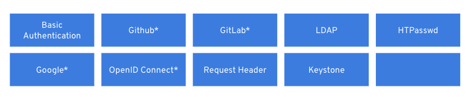

When there is no IdP configured, only one can be added through the User Management option in the console by clicking Add IdP or one or more any time from the cluster settings options as shown below. Typically cluster admin level access or roles with IdP capabilities can configure these options.
Note: Multiple IdP's can co-exist to authenticate in to a OpenShift Cluster.

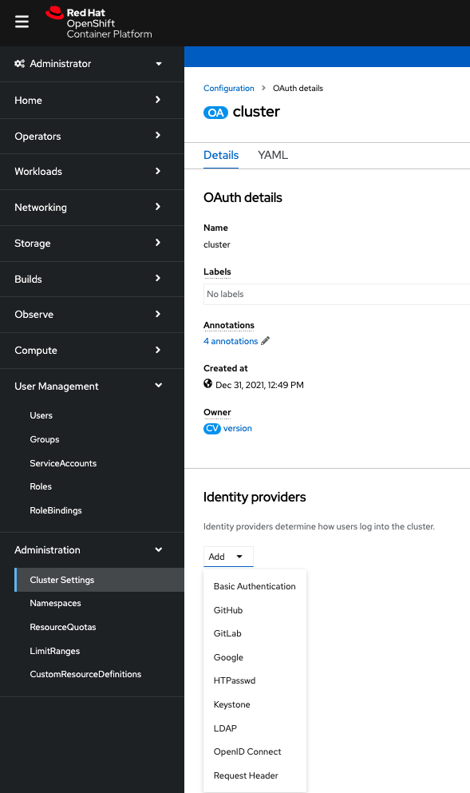

This repository can help bootstrap the different Identity Providers that OpenShift can authenticate with. You'll find documentation for each specific IdP mechanism and automation to drive the deployments.

## LDAP Authentication

We will demonstrate the LDAP authentication using a Red Hat Identity Manager (RH IDM) server that we created.

Red Hat Identity Manager(RHPDM) provides many feature including:

- Maintain the identities and grouping mechanisms in one central place: the IdM server
- Centrally manage different types of credentials such as passwords, PKI certificates, OTP tokens, or SSH keys
- Apply policies uniformly to multiples of machines at the same time
- Manage POSIX and other attributes for external Active Directory users
- Set different access levels for users by using host-based access control, delegation, and other rules
- Centrally manage privilege escalation rules (sudo) and mandatory access control (SELinux user mapping)
- Maintain central PKI infrastructure and secrets store

To set up RHIDM Server follow the instructions in the Prerequisites section below

To set up RH IDM as the LDAP Server for OCP, follow the steps outlined here - <https://github.com/kenmoini/openshift-identity-crisis/tree/main/ldap>

Once the RH IDM server is set up, follow these steps to download the CA certificate. You will need it later while integrating with OCP.

1. Click on the Authentication tab. A list of certificates will be displayed.
2. Click on the Serial Number 1 link for the CA Certificate.
3. Click on the ‘Actions’ menu and select ‘Download’.

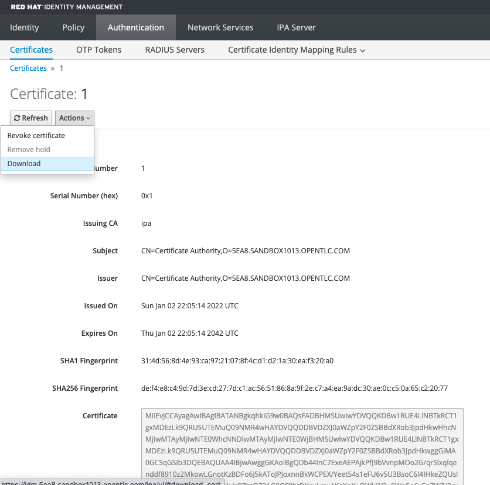

To integrate OCP with the LDAP Server, you can either use the OCP web console or use the 'oc' commands. We will go over both options below.

### Option 1: Using OCP Web Console

1. Log into the OCP console using cluster admin privileges.
2. Switch to the Administrator perspective, if not already on it.
3. Navigate to Cluster Settings under the Administration menu on the left.
4. Click on the Configuration tab on the right, and search for the text ‘OAuth’.
5. Select OAuth and scroll to the bottom of the page. You will see the Identity Providers that are present.
6. Click on the Add dropdown and select LDAP. A form will appear.
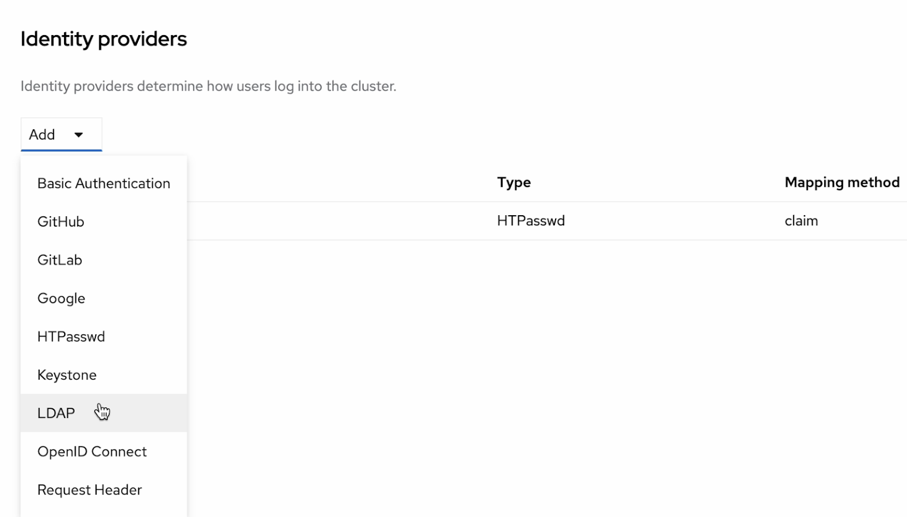
7. Enter the following details:

- **Name**: You can use any name of your choice.
- **URL**: A URL in RFC2255 format. In our case, with RHIDM, it looks something like this -
ldaps://<ldap-server-hostname>:636/cn=users,cn=accounts,dc=7zh7k,dc=sandbox2966,dc=opentlc,dc=com?uid?sub?(uid=*)
- **Bind DN**: This has the UID of the LDAP Admin user, followed by the common names and domain components. In our case, uid=admin,cn=users,cn=accounts,dc=5ea8,dc=sandbox1013,dc=opentlc,dc=com
- **Bind password**: Password of the LDAP Admin user. In our case, s3cur3P455W0rd
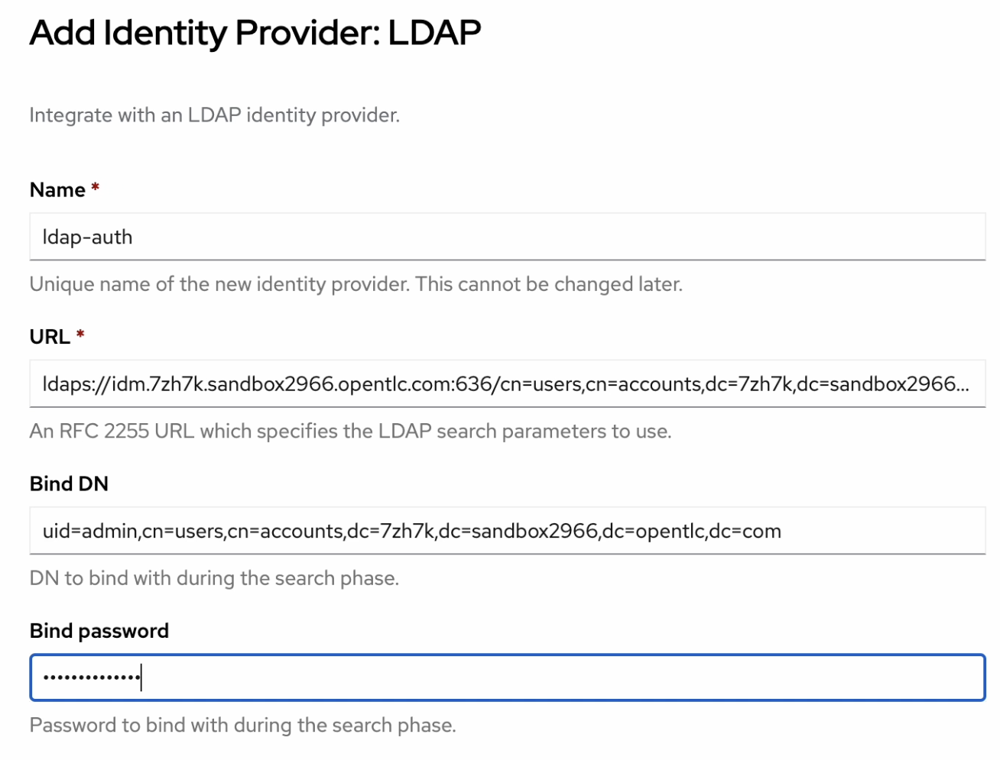
- **Attributes**: Most of this is already mapped. You can add 'mail' to map the 'email' field.
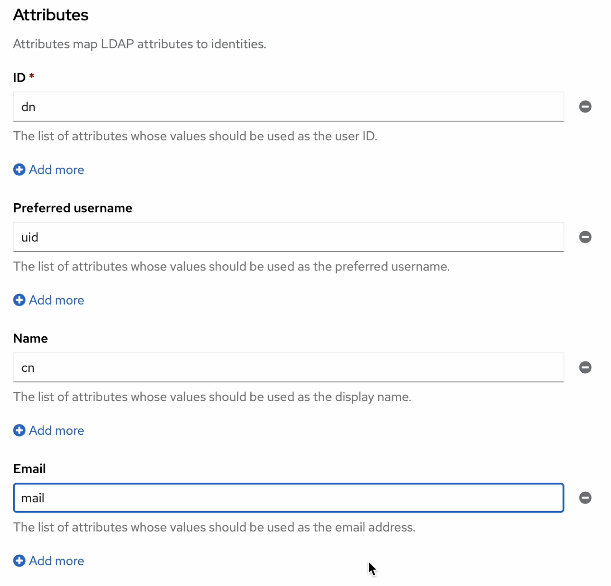
- **CA file**: Add the CA Certificate file downloaded from the LDAP Server. The steps for downloading the certificate from RH IDM are given above.

8. Click on the 'Add' button. This will create a Secret which stores the admin password, and a Config Map which stores the certificate. Both of these will be created under the openshift-config project. It will then add the LDAP configuration to the OAuth YAML file.
9. Click on the Cluster Operators tab under Cluster Settings. The status of the authentication operator will change from Available to Progressing and then back to Available when the changes are applied.
10. You can now log out to test the LDAP integration.

### Option 2: Using ‘oc’ commands

1. Create a secret for the Bind Password called ldap-bind-password. If you used our script, it is the admin password, otherwise use the password from your LDAP with admin access.

```
export BIND_PASSWORD="s3cur3P455W0rd"

oc create secret generic ldap-bind-password --from-literal=bindPassword=${BIND_PASSWORD} -n openshift-config
```

*Note: The secret key must be called as bindPassword as you see above.*

2. Create a config map for the CA certificate.

```
oc create configmap ldap-ca-cert --from-file=ca.crt=<cert-file-name>.pem -n openshift-config
```

*Note: The config map key must be called ca.crt*

3. This configuration can be added manually to the configuration YAML or through the automated configure.sh from the ldap folder on the github project.

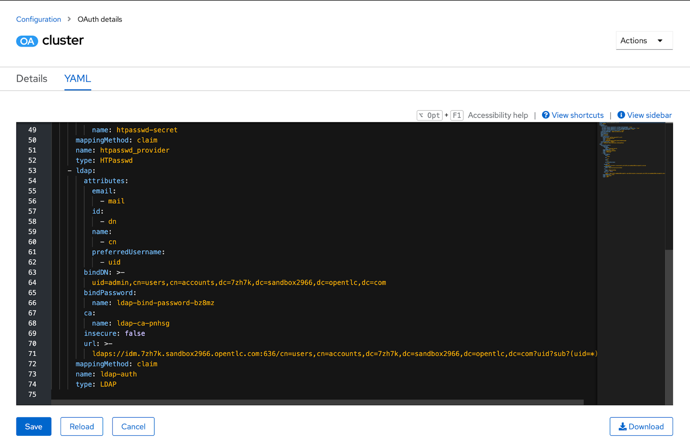

```
apiVersion: config.openshift.io/v1
kind: OAuth
metadata:...
spec:
 identityProviders:
   - htpasswd:...
   - ldap:
       attributes:
         email:
           - mail
         id:
           - dn
         name:
           - cn
         preferredUsername:
           - uid
       bindDN: >-
         uid=admin,cn=users,cn=accounts,dc=7zh7k,dc=sandbox2966,dc=opentlc,dc=com
       bindPassword:
         name: ldap-bind-password-bz8mz
       ca:
         name: ldap-ca-pnhsg
       insecure: false
       url: >-
         ldaps://idm.7zh7k.sandbox2966.opentlc.com:636/cn=users,cn=accounts,dc=7zh7k,dc=sandbox2966,dc=opentlc,dc=com?uid?sub?(uid=*)
     mappingMethod: claim
     name: ldap-auth
     type: LDAP
```

11. You can now log out to test the LDAP integration.

You can now see ldap-auth as an additional IdP option on the login screen. You can use it to log in using your LDAP credentials.

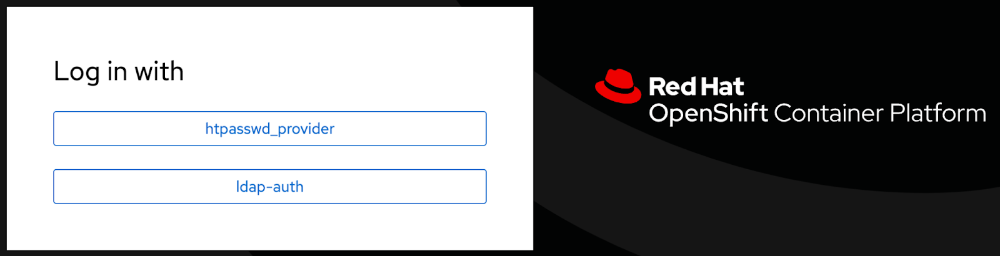

Based on the RHIDM server set up below in this example user names can be admin with password or any of the users user1, user2…user9 can be used.

### Prerequisite - Setting up Red Hat Identity Manager(RHIDM)

You can use this Ansible playbook to create an RHIDM server on AWS among other things such as bastion server, OpenShift Container Platform(OCP) cluster, Gitlab server etc. By configuring variables files this can be accomplished quickly standing up RHIDM server in AWS on an ec2 instance that will be created by the Ansible script. Detailed instructions and the required code can be found in this repo, while we explain some high level steps below.

<https://github.com/kenmoini/grain-tower>

You'll need an SSH Key Pair - if you don't already have one, create a set via the following command:

```
ssh-keygen -t rsa -f ~/.ssh/idprsa
```

The Private Key is secret and will be used to actually connect to created VMs, the Public Key will be passed along to the Playbooks and to AWS to create AWS EC2 Keys from.
If the ssh-agent process is not already running for your local user, start it as a background task:

```
eval $(ssh-agent -s)
```

Add your SSH private key to the ssh-agent:

```
ssh-add ~/.ssh/idprsa

git clone https://github.com/kenmoini/grain-tower
```

Ensure you have got the aws_access_key_id, aws_secret_access_key and region fields associated to the AWS account where the IDM server will be created. Also locally execute the aws configure command to input these values.
With your AWS keys in place and an SSH Key Pair at hand, you can create a file called secret-vars.yaml where you can include variable overrides - see example.secret-vars.yaml for standard variables used.

```
cp example.secret-vars.yaml secret-vars.yaml
```

Modify secret-vars.yaml , since we want to stand up only IDM server the deploy_rh_idm: true is not commented.

```
deploy_rh_idm: true
```

Public Key definitions

shared_public_key: ”replace with the contents of idprsa.pub key in ~/.ssh/idprsa.pub key”
AWS access key and secret key can be passed as an environment variable so can be commented in the file.

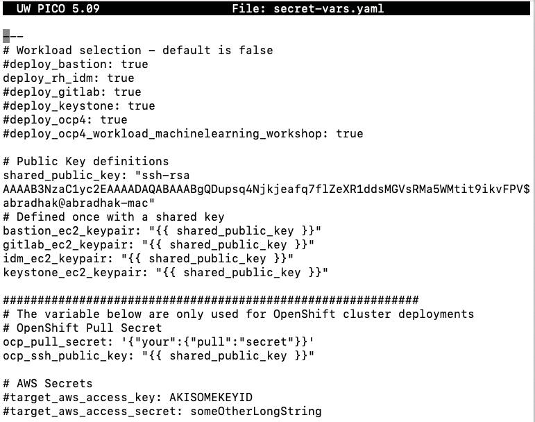

Execute the ansible-playbook command using the secret-vars.yaml file and

```
ansible-playbook -e "@secret-vars.yaml" -e target_aws_access_key=${AWS_ACCESS_KEY_ID} -e target_aws_access_secret=${AWS_SECRET_ACCESS_KEY} bootstrap.yaml
```

When this ansible script completes successfully it will display the idm URL link a few times and it is typically of the pattern idm.domainname.

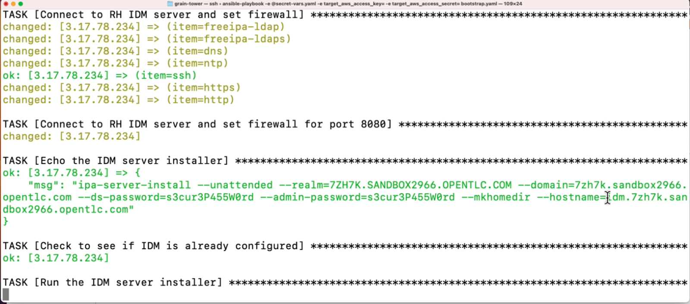

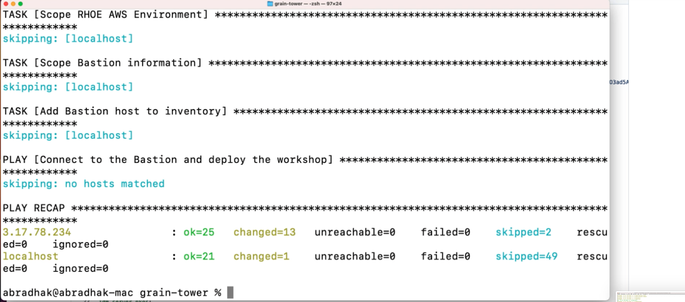

Occasionally the script can fail due to some timeout reasons completing only the partial steps, then you can simply re-execute the command and with the immutable nature it will not duplicate the steps that are successfully completed and finish the process.

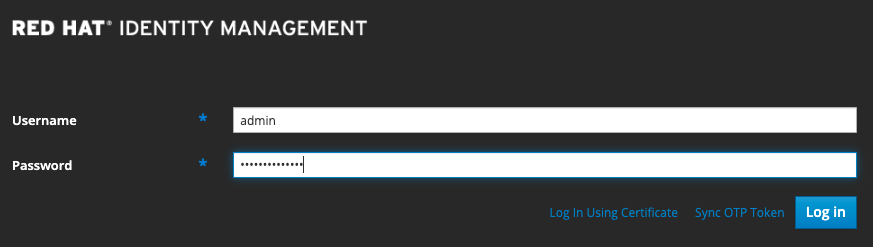

Displays the RHIDM console with users admin and 10 other users from user0,1…9

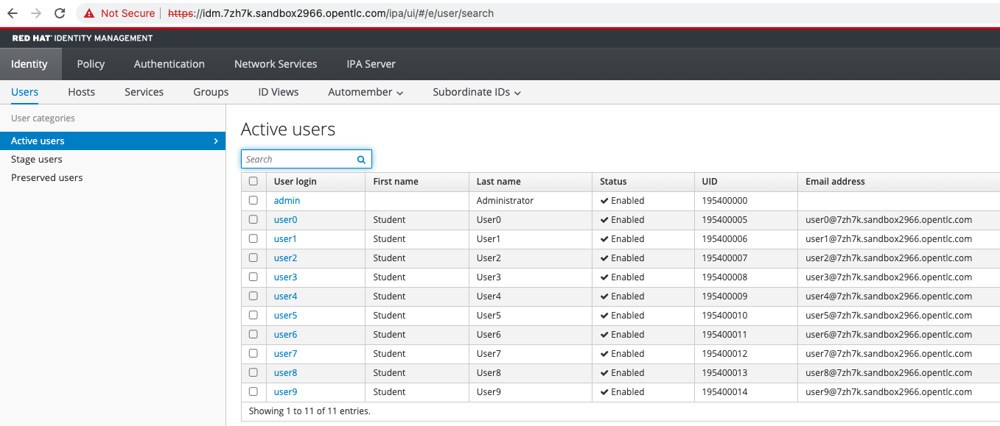

## Conclusion

OpenShift directly supports many ways for users to log in to the cluster. We covered the LDAP IdP provider in this blog using Red Hat Identity Manager as the LDAP server. But any LDAP compliant servers like Active Directory can be integrated using this approach.

## References

- LDAP provider for openshift - <https://github.com/kenmoini/grain-tower/tree/main/rh-idm-on-rhoe-aws>  
- Ansible scripts to install bastion, OpenShift, SSO, IDM, private Gitlab, Keystone - <https://github.com/kenmoini/grain-tower>
- Scripts for all the IdPs - <https://github.com/kenmoini/openshift-identity-crisis>
- Redhat detailed references - <https://docs.openshift.com/container-platform/4.11/authentication/identity_providers/configuring-github-identity-provider.html>  
<https://docs.openshift.com/container-platform/4.11/authentication/understanding-identity-provider.html>
- Authentication methods in Openshift: Part-1 - OpenID Connect Authentication in to OpenShift using Red Hat Single Sign-On
<https://cloud.redhat.com/blog/openid-connect-authentication-in-to-openshift-using-red-hat-single-sign-on?hs_preview=usWPlHHe-79511216983>
- Video - <https://youtu.be/HM6nhNESCi8>
- OpenShift Container Platform(OCP) Authentication IdP using LDAP with Red Hat Identity Manager(RHIDM)
- Video - <https://www.youtube.com/watch?v=x51vFcUw6V8>

Subscribe to SE Synergy and Acceleration channel - <https://www.youtube.com/channel/UCqMv_XDUDenRYi26UElraeg>  
